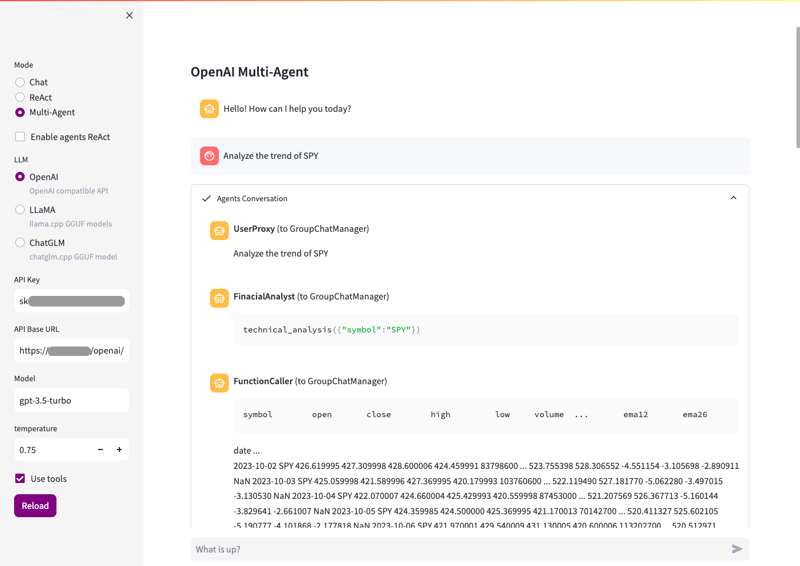

# iauto

`iauto` is a Low-Code intelligent automation tool that integrates LLM and RPA.

## Key Features

* **Low-Code**: Define workflows using YAML, for collaboration and version control.
* **Automation**: Integrated multiple automation frameworks such as [Appium](https://github.com/appium/appium) and [Playwright](https://playwright.dev/python/).
* **Extensible**: Friendly extensible interface that allows customization of any complex Action.
* **AI native**: Create workflows containing LLM using low-code, as well as more complex automation agents based on ***ReAct*** or ***Multi-Agent***.

## News

* Integrate [autogen](https://github.com/microsoft/autogen), define your automation Multi-Agent using YAML.
* Support for running most open source LLM locally is provided through [llama.cpp](https://github.com/ggerganov/llama.cpp).

## Quick Start

### Installation

Python version requirement: >=3.8

`iauto` can be installed from PyPI using `pip`. It is recommended to create a new virtual environment before installation to avoid conflicts.

```bash
pip install -U iauto
```

If you need to run LLM locally, you can enable hardware acceleration in the following ways.

To enable cuBLAS acceleration on NVIDIA GPU:

```bash
CMAKE_ARGS="-DGGML_CUBLAS=ON" pip install -U iauto
```

To enable Metal on Apple silicon devices:

```bash
CMAKE_ARGS="-DGGML_METAL=ON" pip install -U iauto
```

### Examples

Playbook is a YAML formatted file used to describe your workflow. In most cases, all you need to do is write a YAML file.

**Example: Web automation**

This example will open the local browser, then visit https://bing.com, execute JavaScript in the browser, and obtain the result.

`browser.yaml` :

```yaml
playbook:
  description: Open browser and goto https://bing.com
  actions:
    - browser.open:
        args:
          exec: /Applications/Google Chrome.app/Contents/MacOS/Google Chrome
        result: $browser
    - browser.goto:
        args:
          browser: $browser
          url: https://bing.com
        result: $page
    - repeat:
        actions:
          - browser.eval:
              args:
                page: $page
                javascript: new Date()
              result: $now
          - log: $now
          - time.wait: 2
```

Run the playbook:

```bash
python -m iauto ./browser.yaml
```

**Example: Chatbot**

This example will start an interactive chatbot in the terminal. You can set the OPENAI_API_KEY in the environment variable, which will give you an application similar to ChatGPT.

`chatbot.yaml` :

```yaml
playbook:
  description: Chat to OpenAI
  actions:
    - llm.session:
        result: $session
    - repeat:
        actions:
          - shell.prompt:
              args: "Human: "
              result: $prompt
          - llm.chat:
              args:
                session: $session
                prompt: $prompt
              result: $message
          - shell.print: "AI: {$message}"
```

Set your OpenAI API key:

```bash
export OPENAI_API_KEY=sk-<YOUR_API_KEY>
```

Run the playbook:

```bash
python -m iauto ./chatbot.yaml
```

**[More example playbooks](./playbooks)**

## Playground

iauto provides a web-based playground program to facilitate the execution of some workflows. For example, the LLM playground is a workspace for LLM Chat, ReAct reasoning, and Multi-Agent tasks.

Run LLM playground:

```bash
python -m iauto --playground=llm --playbook-dir=./playbooks
```

**LLM playground screenshot:**



## Contribution

We are extremely open to contributions, whether it be in the form of a new feature, improved infrastructure, or better documentation.

### Development setup

* Code Style: [PEP-8](https://peps.python.org/pep-0008/)
* Docstring Style: [Google Style](https://sphinxcontrib-napoleon.readthedocs.io/en/latest/example_google.html)

```bash
# Create python venv
python -m venv .venv
source .venv/bin/activate

# Install dependencies
pip install -r requirements.txt
pip install -r requirements-dev.txt

# Apply autopep8, isort and flake8 as pre commit hooks
pre-commit install
```
### Build

```bash
./build.sh
```

## License

[MIT](./LICENSE)

 icon license: https://openmoji.org/library/emoji-1F9BE
