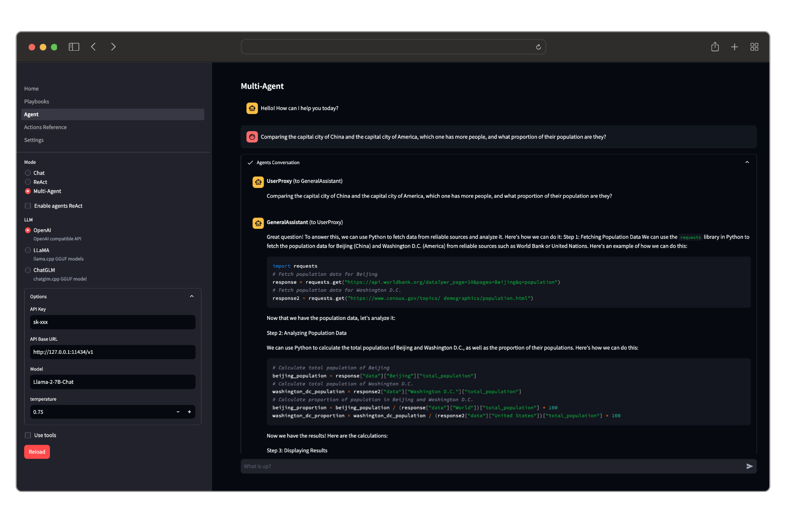

[Documentation](https://shellc.github.io/iauto)

# iauto

`iauto` is a low-code engine for building and deploying AI agents.

- **AI**: Cutting-edge AI capabilities.
- **Low-Code**: Define your agents using YAML.
- **Automation**: Integrated automation frameworks like [Appium](https://github.com/appium/appium) and [Playwright](https://playwright.dev/python/).
- **Extensible**: Well-designed Python API.

## News

- Integrated [autogen](https://github.com/microsoft/autogen): Create your Multi-Agent system efficiently with iauto.
- Run most open source LLMs locally using [llama.cpp](https://github.com/ggerganov/llama.cpp) and [llama-cpp-python](https://github.com/abetlen/llama-cpp-python).

## Quick Start

### Installation

Python version requirement: >=3.8

`iauto` can be installed from PyPI using `pip`. It is recommended to create a new virtual environment before installation to avoid conflicts.

```bash
pip install -U iauto
```

If you want to run LLM locally, you can enable hardware acceleration in the following ways.

To enable cuBLAS acceleration on NVIDIA GPU:

```bash
CMAKE_ARGS="-DGGML_CUBLAS=ON" pip install -U iauto
```

To enable Metal on Apple silicon devices:

```bash
CMAKE_ARGS="-DGGML_METAL=ON" pip install -U iauto
```

## Command-line tool

Usage:

```bash
python -m iauto --help

or

ia --help
```

Run playbook:

```bash
ia run ./your-plabook.yaml
```

**[Example playbooks](./playbooks)**

## Playground

`iauto` provides a web-based application for running playbooks, LLM Chat, ReAct reasoning, and Multi-Agent tasks.

Launch playground:

```bash
ia playground
```

**Screenshot:**



## Contribution

We are extremely open to contributions, whether it be in the form of a new feature, improved infrastructure, or better documentation.

### Development setup

- Code Style: [PEP-8](https://peps.python.org/pep-0008/)
- Docstring Style: [Google Style](https://sphinxcontrib-napoleon.readthedocs.io/en/latest/example_google.html)

```bash
# Create python venv
python -m venv .venv
source .venv/bin/activate

# Install dependencies
pip install -r requirements.txt
pip install -r requirements-dev.txt

# Apply autopep8, isort and flake8 as pre commit hooks
pre-commit install
```

### Build

```bash
./build.sh
```

## License

[MIT](./LICENSE)

 icon license: https://openmoji.org/library/emoji-1F9BE
